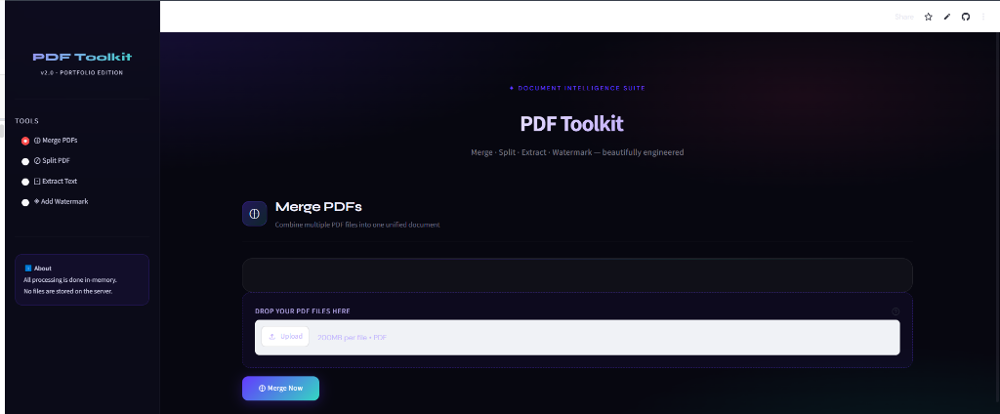
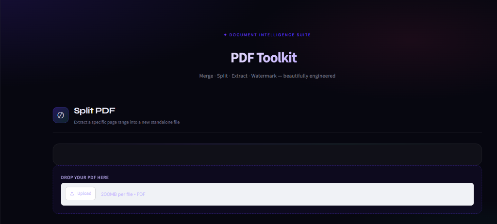
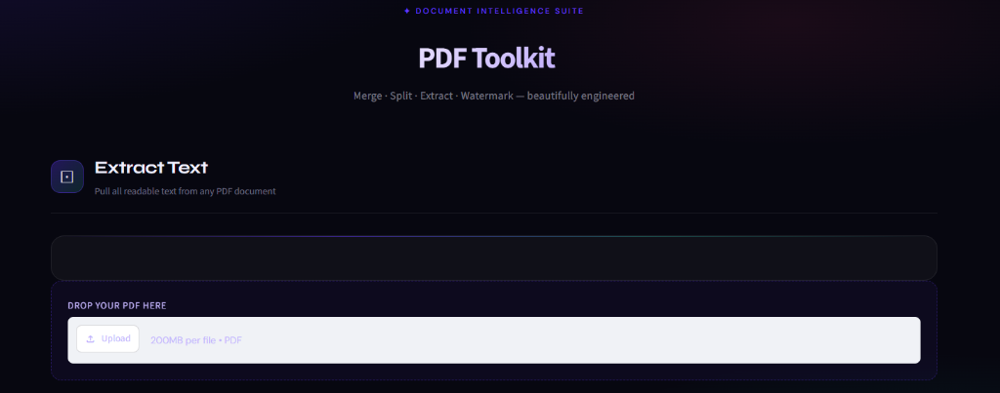
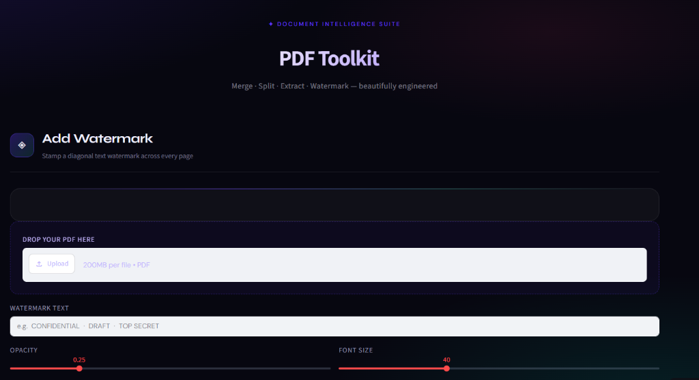

# 📄 PDF Toolkit

A clean, browser-based PDF utility app built with **Python** and **Streamlit**.  
No installs needed for end users — just upload, process, and download.

---

## ✨ Features

| Tool | Description |
|------|-------------|
| 🔀 **Merge PDFs** | Combine multiple PDF files into one, in upload order |
| ✂️ **Split PDF** | Extract a specific page range from any PDF |
| 📝 **Extract Text** | Pull all readable text out of a PDF, download as `.txt` |
| 💧 **Add Watermark** | Stamp diagonal text (e.g. CONFIDENTIAL) on every page |

---

## 🚀 Live Demo

> 🔗 [Launch App on Streamlit Cloud](https://pdf-toolkit-project.streamlit.app/)

---

## 🛠️ Tech Stack

- **Python 3.10+**
- **Streamlit** — UI framework
- **pypdf** — PDF reading, writing, merging, splitting
- **ReportLab** — Watermark generation

---

## 📁 Project Structure

```
pdf_toolkit/
├── app.py                  # Main Streamlit app
├── requirements.txt
├── screenshots/            # App screenshots
│   ├── extract.png
│   ├── merge.png
│   ├── split.png
│   └── watermark.png
├── utils/
│   ├── __init__.py
│   ├── merge.py            # Merge logic
│   ├── split.py            # Split logic
│   ├── extract.py          # Text extraction logic
│   └── watermark.py        # Watermark generation logic
└── README.md
```

---

## ⚙️ Run Locally

```bash
# 1. Clone the repo
git clone https://github.com/danixh-95/pdf-toolkit.git
cd pdf-toolkit

# 2. Create and activate a virtual environment
python -m venv venv
source venv/bin/activate        # Windows: venv\Scripts\activate

# 3. Install dependencies
pip install -r requirements.txt

# 4. Launch the app
streamlit run app.py
```

The app opens at **https://pdf-toolkit-project.streamlit.app/**

---

## ☁️ Deploy to Streamlit Cloud (Free)

1. Push this repo to GitHub
2. Go to [streamlit.io/cloud](https://streamlit.io/cloud) and sign in
3. Click **New app** → select your repo → set `app.py` as the entry point
4. Click **Deploy** — live in ~60 seconds!

---

## 📸 Screenshots

### 🔀 Merge PDFs


### ✂️ Split PDF


### 📝 Extract Text


### 💧 Add Watermark


---

## 📌 Notes

- Text extraction only works on **text-based PDFs** (not scanned images)
- All file processing is done **in-memory** — no files are stored on the server
- Watermark opacity and font size are adjustable via sliders

---

## 👤 Author

**Danish Arshad**  
[GitHub](https://github.com/danixh-95) · [LinkedIn](www.linkedin.com/in/danish-arshad095)
